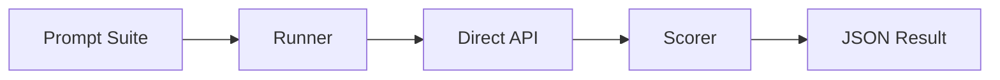

For a long time, I trusted the Gateway. It's the heart of the system—the abstraction layer that makes switching from a local Llama to a cloud-hosted Gemini feel like changing a lightbulb. 

But when you're trying to determine if a new model is actually "smarter" or just better at pretending, the Gateway is a liability.

The Gateway is designed for stability and routing, not for forensic analysis. It adds latency, it handles retries in ways that mask model instability, and it wraps responses in a layer of "helpfulness" that can smudge the raw capabilities of the underlying weights. If you want to know how a model actually performs, you have to bypass the middleman.

That's why I built the direct benchmark harness.

The goal was simple: strip away everything except the API call and the response. No routing, no system-wide overrides, no "helpful" wrappers. Just the raw model, a set of rigorous prompts, and a scoring engine that doesn't care about the Gateway's uptime.

### What's under the hood

The harness lives in `benchmarks/` and operates on a "raw-in, structured-out" philosophy.

- **The Runner:** A provider-agnostic engine that speaks OpenAI-compatible APIs. It doesn't know about OpenClaw's complex routing; it just knows how to hit an endpoint.
- **Prompt Suites:** Instead of haphazard testing, I moved to JSON-defined suites. We have specific categories: `reasoning`, `coding`, `instruction_following`, and `safety`. Each prompt has an expected answer and a set of acceptable variants.
- **The Scorer:** A heuristic engine that maps responses to a rubric. It looks for keywords and structural markers to assign a score, turning a wall of text into a hard number.

### The Operational Lesson

The biggest realization wasn't about the models, but about the measurement.

When I ran the first few tests, I found a "Ghost in the Machine" effect. Models that looked identical through the Gateway showed wild variance when hit directly. One model would fail a simple logic puzzle 20% of the time, but the Gateway's retry logic or a slightly different system prompt was masking that instability.

By removing the abstraction, I unlocked the ability to see *why* a model fails. Is it a timeout? A refusal? A hallucination that usually gets filtered? You can't see that when you're looking at a "Success" message from a routing layer.

> The Gateway is for production; the harness is for truth.
{: .prompt-tip }

We're not at "LLM-as-judge" yet—the scoring is still mostly heuristic—and it's strictly sequential, which means it's slow as hell for large suites. But the clarity is worth the wait. I'd rather have a slow, honest answer than a fast, filtered one.
